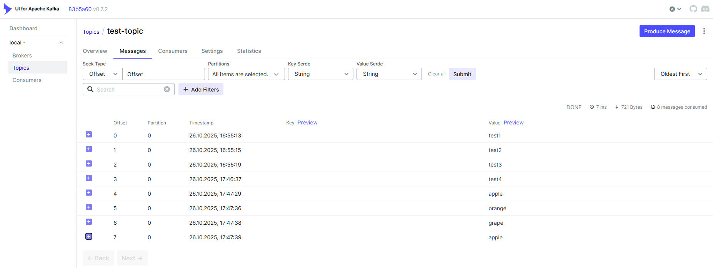
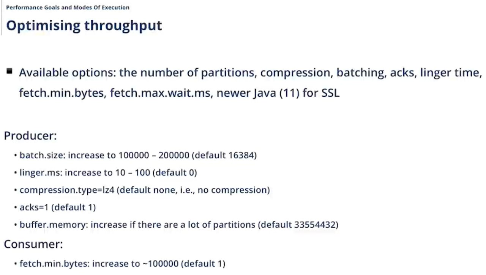
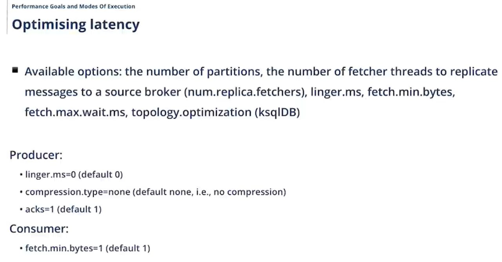
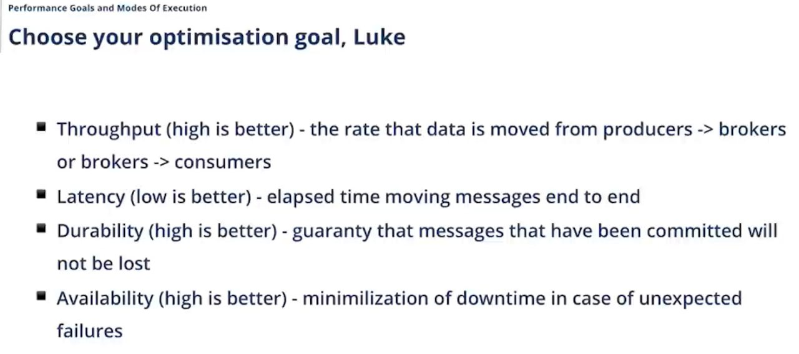
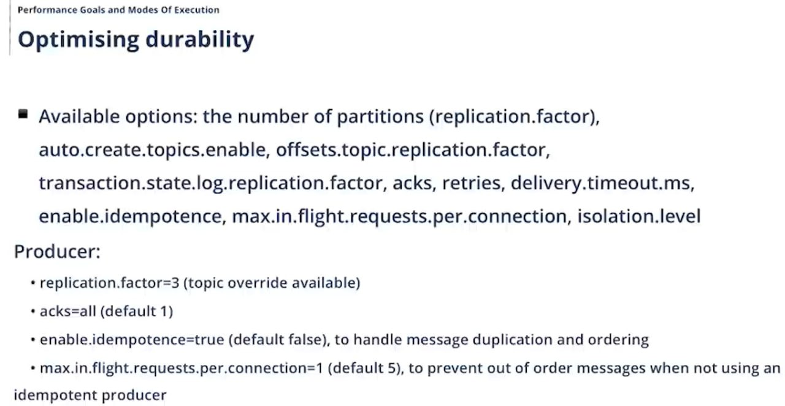
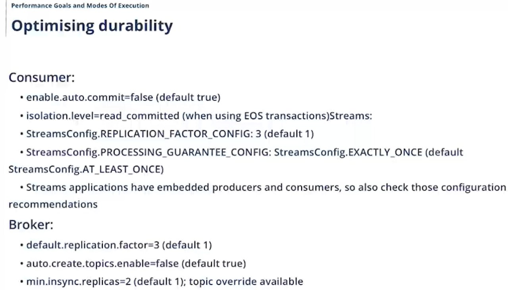
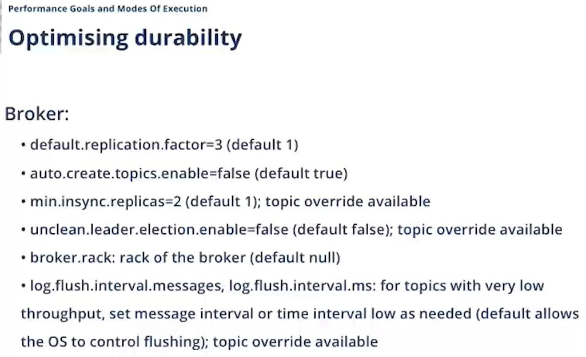
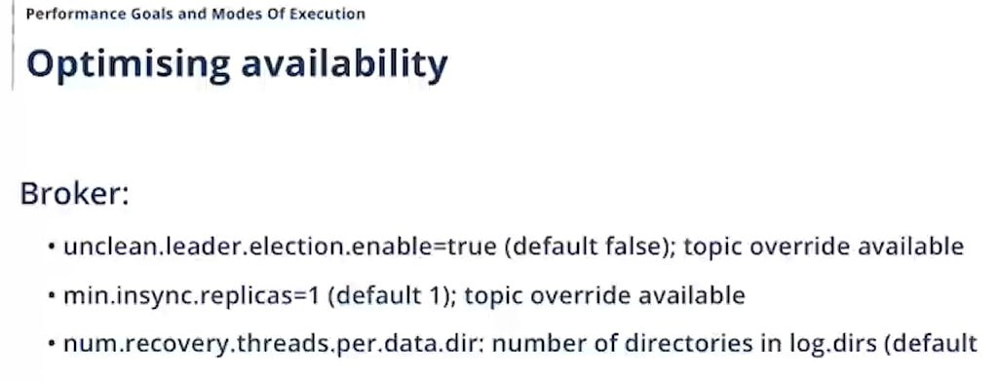
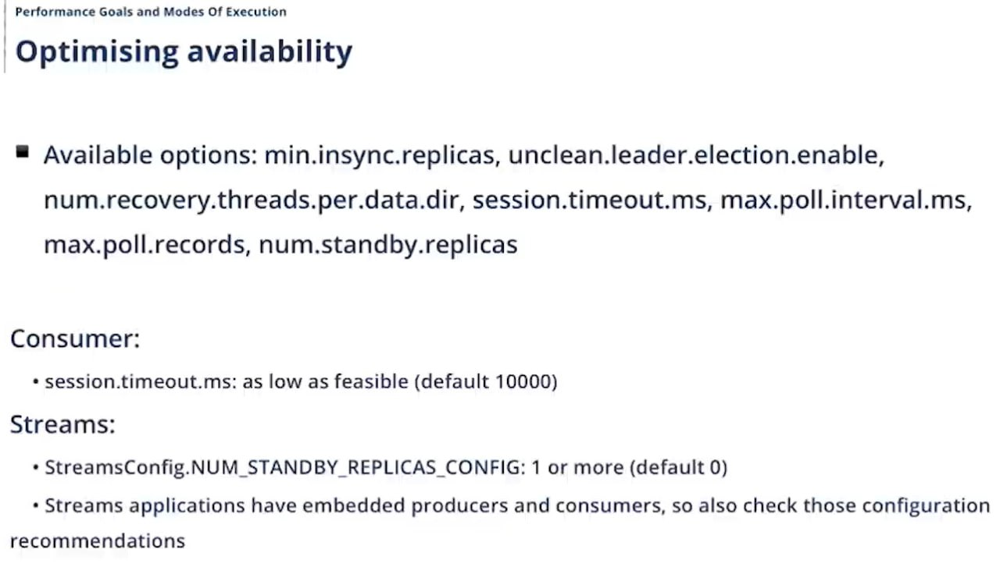

# Apache Kafka + Docker + Java

## Цель
Развернуть Apache Kafka в Docker с помощью docker-compose, создать тестовый топик, протестировать работу через CLI и написать два Java-приложения: Producer (отправляет сообщения) и Consumer (читает сообщения).

## Задание
1. Поднять окружение Kafka в Docker с помощью docker-compose.
2. Проверить, что все контейнеры работают.
3. Создать топик test-topic через команду в терминале.
4. Отправить тестовые сообщения в топик через Kafka CLI.
5. Прочитать сообщения из топика через Kafka CLI.
6. Написать Java Producer, который отправляет случайные данные (например, фрукты) в Kafka.
7. Написать Java Consumer, который читает эти данные.
8. Проверить отправку и получение через Kafka UI.
9. Остановить контейнеры и удалить все данные.

```
PS D:\projects\kafka-demo> docker-compose up -d
[+] Running 13/16
✔ zookeeper Pulled                                                                                                                                                             47.5s
✔ kafka Pulled                                                                                                                                                                 47.7s
✔ kafka-ui Pulled                                                                                                                                                               3.2s
[+] Running 4/4
✔ Network kafka-demo_default  Created                                                                                                                                           0.0s
✔ Container zookeeper         Started                                                                                                                                           1.4s
✔ Container kafka             Started                                                                                                                                           1.1s
✔ Container kafka-ui          Started                                                                                                                                           1.3s
PS D:\projects\kafka-demo> docker ps
CONTAINER ID   IMAGE                             COMMAND                  CREATED          STATUS          PORTS                                                                                          NAMES
1729650025cf   provectuslabs/kafka-ui:latest     "/bin/sh -c 'java --…"   16 seconds ago   Up 14 seconds   0.0.0.0:8080->8080/tcp, [::]:8080->8080/tcp                                                    kafka-ui
7a03b221fb97   confluentinc/cp-kafka:7.6.0       "/etc/confluent/dock…"   16 seconds ago   Up 15 seconds   0.0.0.0:9092->9092/tcp, [::]:9092->9092/tcp, 0.0.0.0:29092->29092/tcp, [::]:29092->29092/tcp   kafka
914fb8b2dc6b   confluentinc/cp-zookeeper:7.6.0   "/etc/confluent/dock…"   17 seconds ago   Up 15 seconds   0.0.0.0:2181->2181/tcp, [::]:2181->2181/tcp                                                    zookeeper
PS D:\projects\kafka-demo> docker exec -it kafka bash
[appuser@7a03b221fb97 ~]$ kafka-topics --create --topic test-topic --bootstrap-server localhost:9092 --partitions 1 --replication-factor 1
Created topic test-topic.
[appuser@7a03b221fb97 ~]$ kafka-topics --list --bootstrap-server localhost:9092
test-topic
[appuser@7a03b221fb97 ~]$ kafka-console-producer --topic test-topic --bootstrap-server localhost:9092
>test1
>test2
>test3
>[appuser@7a03b221fb97 ~]$ kafka-console-consumer --topic test-topic --from-beginning --bootstrap-server localhost:9092
test1
test2
test3
Processed a total of 3 messages
PS D:\projects\kafka-demo> docker-compose down -v
[+] Running 4/4
 ✔ Container kafka-ui          Removed                                                                                                                                           2.6s 
 ✔ Container kafka             Removed                                                                                                                                           1.5s 
 ✔ Container zookeeper         Removed                                                                                                                                           0.8s 
 ✔ Network kafka-demo_default  Removed                                                                                                                                           0.7s 
```
















